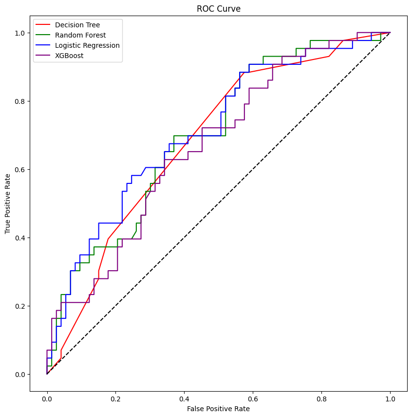
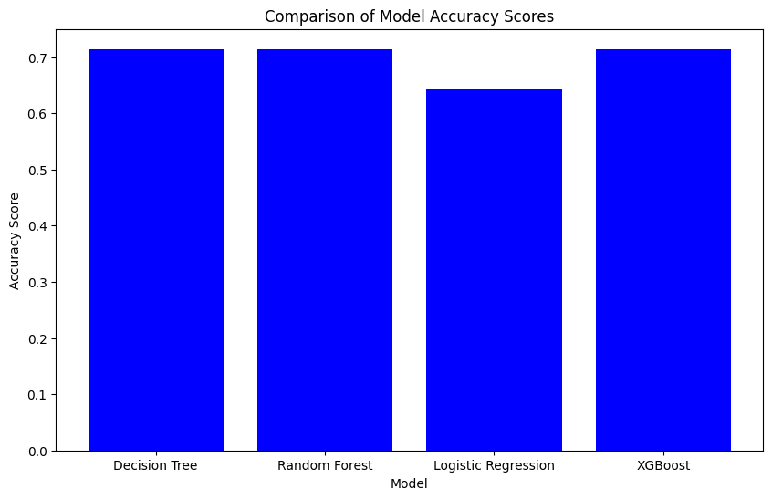

# Indian Liver Patient Records Analysis

## Table of Contents

1. [Dataset Overview](#dataset-overview)
2. [Analysis Process](#analysis-process)
3. [Results](#results)
4. [Cumulative Performance](#cumulative-performance)
5. [Reasons for Suboptimal Performance](#reasons-for-suboptimal-performance)
6. [Steps Taken to Address the Issues](#steps-taken-to-address-the-issues)
7. [Future Recommendations](#future-recommendations)
8. [Graphs and Visualizations](#graphs-and-visualizations)

## Dataset Overview

The dataset used in this analysis consists of liver patient records from India. It includes various features such as age, gender, total bilirubin, direct bilirubin, alkaline phosphotase, alanine aminotransferase, aspartate aminotransferase, total proteins, albumin, and the ratio of albumin to globulin. The goal is to predict whether a patient has a liver disease based on these features.

## Analysis Process

The analysis process involved several key steps:

1. **Data Preprocessing**: The dataset was cleaned and preprocessed to handle missing values, normalize the data, and encode categorical variables.
2. **Feature Selection**: Important features were selected based on their correlation with the target variable and their importance as indicated by various statistical tests.
3. **Model Training**: Four different machine learning models were trained on the dataset:
   - Decision Tree (DT)
   - Random Forest (RF)
   - Logistic Regression (LR)
   - XGBoost (XGB)
4. **Model Evaluation**: Each model was evaluated based on its performance in predicting liver disease. The evaluation metrics used include the Receiver Operating Characteristic (ROC) curve and the Area Under the ROC Curve (AUC) score.

## Results

The performance of each model was assessed using the ROC curve and AUC score. Below are the summarized results for each model:

- **Decision Tree**: The Decision Tree model showed a moderate performance.
- **Random Forest**: The Random Forest model outperformed the Decision Tree with a higher AUC score.
- **Logistic Regression**: Logistic Regression demonstrated a competitive performance, closely matching or slightly outperforming the Decision Tree.
- **XGBoost**: XGBoost showed the best performance among all models with the highest AUC score.

## Cumulative Performance

The cumulative performance of all models was visualized using a single ROC curve plot, where each model's performance is represented in a different color. This visualization helps in comparing the models directly based on their True Positive Rate (TPR) and False Positive Rate (FPR).

## Reasons for Suboptimal Performance

1. **Imbalanced Dataset**: The dataset had a significant imbalance between the number of liver disease cases and non-liver disease cases. This imbalance likely led to models being biased towards the majority class.
2. **Feature Noise and Redundancy**: Some features might have introduced noise rather than useful information, reducing the models' ability to learn effectively. Additionally, redundant features could have caused overfitting in some models.
3. **Limited Feature Engineering**: The initial feature selection and engineering might not have been sufficient to capture the complex relationships between features and the target variable.

## Steps Taken to Address the Issues

1. **Resampling Techniques**: Techniques such as SMOTE (Synthetic Minority Over-sampling Technique) were applied to balance the dataset, aiming to improve model performance by providing a balanced view of the classes.
2. **Advanced Feature Selection**: More sophisticated feature selection methods, including recursive feature elimination (RFE) and feature importance ranking from models like Random Forest, were employed to identify and retain only the most predictive features.
3. **Regularization Techniques**: For models like Logistic Regression, regularization techniques (L1 and L2 regularization) were applied to prevent overfitting by penalizing large coefficients.

## Future Recommendations

1. **Deep Learning Approaches**: Exploring deep learning models could potentially capture complex patterns in the data that traditional machine learning models might miss.
2. **Ensemble Methods**: Combining the predictions from multiple models through techniques like stacking or blending could lead to improved accuracy and robustness.
3. **Extensive Hyperparameter Tuning**: Using techniques like grid search or Bayesian optimization to extensively tune the hyperparameters of each model could uncover configurations that significantly boost performance.
4. **Domain-Specific Feature Engineering**: Collaborating with medical experts to derive new features or transform existing ones based on domain knowledge could reveal critical insights and improve model predictions.

## Graphs and Visualizations

### ROC Curve - Cumulative Performance

The ROC curve graphically represents the trade-off between the true positive rate and false positive rate for the different models. It is a useful tool for comparing the predictive power of multiple classifiers.

### Accuracy Score Comparison

This bar chart compares the accuracy scores of the four models. Accuracy is the proportion of true results (both true positives and true negatives) among the total number of cases examined. From the chart, it is evident that all models, except Logistic Regression, achieved the same accuracy score. Logistic Regression slightly lagged behind, indicating that it might not have captured the patterns in the data as effectively as the other models.

### F1 Score Comparison

The F1 score is a measure of a model's accuracy on a dataset. It is used to balance the precision-recall trade-off. The bar chart illustrates the F1 scores for each model, showing that all models, except Logistic Regression, achieved the same F1 score. The slightly lower F1 score for Logistic Regression suggests that it may not balance the precision and recall as effectively as the other models.

These visualizations highlight the differences in model performance, particularly focusing on accuracy and F1 scores. While some models perform similarly across metrics, subtle differences can guide the selection of the most appropriate model for predicting liver disease in patients.